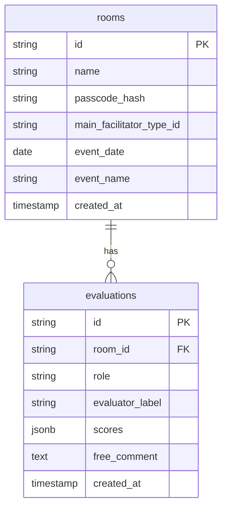

# ファシリテーターリフレクション データ設計

## 1. 概要

- バックエンドに **Supabase（PostgreSQL）** を想定（無料枠・RLS でルーム単位のアクセス制御）
- ルーム単位でデータを分離し、パスコードを知る者のみがアクセス可能とする

## 2. エンティティ概要

## 3. テーブル定義

### 3.1 rooms（ルーム）

| カラム | 型 | 必須 | 説明 |
|--------|------|------|------|
| id | UUID | ○ | 主キー。ルームの一意識別子。参加用URLに含める |
| name | TEXT | ○ | ルーム名 |
| passcode_hash | TEXT | ○ | パスコードのハッシュ（bcrypt 等）。照合時のみ使用、平文は保存しない |
| main_facilitator_type_id | TEXT | ○ | メインファシリの16タイプID（例: conductor）。診断アプリの facilitatorTypes の id と一致 |
| event_date | DATE | - | WS・会議の日付（任意） |
| event_name | TEXT | - | WS・会議の名前（任意） |
| expected_sub_count | INTEGER | - | 招待予定のサブ人数（任意）。結果画面で「あと○人の入力待ち」表示に利用。Step 14 で追加 |
| expected_participant_count | INTEGER | - | 招待予定の参加者人数（任意）。同上。Step 14 で追加 |
| created_at | TIMESTAMPTZ | ○ | 作成日時 |

### 3.2 evaluations（評価）

1ルームにつき、メイン1件 ＋ サブ・参加者それぞれ複数件が紐づく。

| カラム | 型 | 必須 | 説明 |
|--------|------|------|------|
| id | UUID | ○ | 主キー |
| room_id | UUID | ○ | ルームID（外部キー） |
| role | TEXT | ○ | 役割: `main` / `sub` / `participant` |
| evaluator_label | TEXT | - | 表示用ラベル（匿名の場合は空、ニックネーム可） |
| scores | JSONB | ○ | 評価項目ごとのスコア。項目IDは [05_evaluation_items.md](05_evaluation_items.md) で定義（E1～E4, B1～B10, F1～F4）。例: `{"E1": 4, "B1": 5, ...}` |
| free_comment | TEXT | - | 自由記述（全体または項目ごとを1フィールドにまとめるかは画面設計に合わせる） |
| created_at | TIMESTAMPTZ | ○ | 送信日時 |

- **「全員の入力が揃ったか」の判定**: 同一 room_id の evaluations の件数・role の内訳をアプリ側で判定する（例: main が1件あり、招待した人数分の sub/participant が揃ったら結果表示、など。招待人数の管理が必要な場合は 3.3 を参照）

### 3.3 補足: 招待人数の管理（任意）

「全員揃った」を厳密にしたい場合、ルーム作成時に「サブ○人・参加者○人を招待する」などを記録するテーブルを増やすか、rooms に `expected_sub_count`, `expected_participant_count` のようなカラムを追加する設計が考えられる。MVP では「メイン1件 ＋ 任意でサブ・参加者が N 件」とし、結果表示は「メインが1件送信済みなら表示可能」や「最低メイン1件で表示し、他者は随時反映」など、シンプルなルールでも可。要否は要件で詰める。

## 4. 結果の集計・表示

- **集計**: 全員入力完了後に、同一 room_id の evaluations を取得し、scores を集計（平均・分布など）。main_facilitator_type_id は rooms から参照し、タイプ別の分析・振り返りの問い・アクション提案のルールに渡す
- **キャッシュ**: 集計結果・生成した問い・アクション提案を DB に保存するか、都度計算するかは実装時に判断。保存する場合は `room_results` のようなテーブルに room_id, aggregated_json, generated_questions, action_proposals, updated_at を格納する形が考えられる

## 5. アクセス制御（RLS 方針）

- **rooms**: パスコード（またはパスコード検証後のトークン）を知っているセッションのみ、当該 room_id の読み取り可。作成は認証なしまたは「ルーム作成」用の簡易認証のみ
- **evaluations**: 当該 room_id へのアクセス権がある場合のみ、そのルームの evaluations の読み取り・挿入が可能。他ルームのデータは見えない

## 6. 回答と集計・分析の流れ（ロジックの置き場所）

- **回答（評価入力）**
  - フォームで入力された 18 項目のスコア（1〜5）を検証し、送信用の `scores` オブジェクトに組み立てる処理は **src/lib/evaluationInput.ts** の `validateAndBuildScores` に集約している。EvaluatePage はこの関数の結果を evaluations に INSERT する。
- **分析結果（結果画面）**
  - 取得した evaluations 一覧から「項目別平均」「役割別件数」「振り返り文言」を導く処理は **src/lib/resultAnalysis.ts** に集約している。
    - `computeAverages(evaluations, itemIds)` … 各項目 ID について、全評価の scores[id] の平均を算出（1〜5 の値のみ有効）。
    - `getRoleCounts(evaluations)` … main / sub / participant の件数。
    - `getReflectionContent(typeId)` … ルームの main_facilitator_type_id に対応する振り返りの問い・アクション提案（reflectionByType）を返す。
  - ResultPage は room と evaluations を取得したあと、上記関数で averages・roleCounts・reflection を求め、表示に使う。

## 7. 更新履歴

| 日付 | 内容 |
|------|------|
| （初版） | 機能要件に基づきルーム・評価のテーブル概要を記載。Supabase・RLS を想定 |
| （ロジック整理） | 6. 回答と集計・分析の流れを追加。evaluationInput.ts / resultAnalysis.ts の役割を記載。 |
