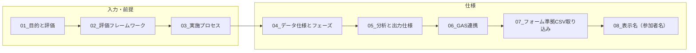

# 要件定義 オーバービュー

実践スキル定着度分析アプリの要件を、目的からデータ・分析・出力・GAS連携まで一貫したロジックで整理したものです。アプリ実装の「正」は本 requirements フォルダのドキュメントとします。

## ドキュメント構成と流れ

| ドキュメント | 内容 |
|-------------|------|
| [01_目的と評価.md](01_目的と評価.md) | 背景・課題、Level1〜3の評価位置づけ、ROI可視化の目的 |
| [02_評価フレームワーク.md](02_評価フレームワーク.md) | 5軸・各3問・5段階定義、スコア算出方法 |
| [03_実施プロセス.md](03_実施プロセス.md) | PreWS / PostWS / Follow-up の実施内容と測定目的 |
| [04_データ仕様とフェーズ.md](04_データ仕様とフェーズ.md) | **用語統一表**、CSV形式、Phase1〜3の判定条件 |
| [05_分析と出力仕様.md](05_分析と出力仕様.md) | 分析式、レポート構成、出力ファイル一覧 |
| [06_GAS連携.md](06_GAS連携.md) | 個人用スライド生成のプレースホルダー・2段階アプローチ要約 |
| [07_フォーム準拠_CSV取り込み仕様.md](07_フォーム準拠_CSV取り込み仕様.md) | フォームエクスポートCSVの列名・値の正規化（実装済み: `src/csv_normalizer.py`） |
| [08_表示名（参加者名）仕様.md](08_表示名（参加者名）仕様.md) | 個別レポート・スライド・GASで使う参加者表示名の決定ロジック（氏名優先、空ならメール@前） |
| [10_分析コメント品質要件.md](10_分析コメント品質要件.md) | スライド挿入内容の分析コメント（S_block_1、O_block_2/3）の文章量と納得度。活用意欲・アクション宣言・満足度・理解度の活用を含む。O_block_1_body は廃止（13 参照） |
| [12_C_block_comment_requirements.md](12_C_block_comment_requirements.md) | C_block_1_body・C_block_2_1_body・C_block_2_2_body の文章量（約400文字／約300文字）と納得度向上の要件 |
| [13_スライド3_組織別分析_プレースホルダー仕様.md](13_スライド3_組織別分析_プレースホルダー仕様.md) | スライド3（組織別分析）LAYOUT analysis_by_organization のプレースホルダー（O_respondents_1, Ogr*, OrkA_1 等）。O_block_1_body 廃止後の仕様 |
| [14_組織別スライド_表プレースホルダー置換要件.md](14_組織別スライド_表プレースホルダー置換要件.md) | 組織別スライドの表プレースホルダー置換・GAS での ORGANIZATION_DATA 利用 |
| [15_スライド3_組織別分析総評_文章差別化要件.md](15_スライド3_組織別分析総評_文章差別化要件.md) | スライド3の分析総評（強み・伸びしろ）を組織ごとに差別化する要件。活用意欲・アクション宣言・理解度を必ず参照し、強みで使用した宣言を伸びしろで重複させない |
| [16_O_block_2_3_言い回し多様化と可読性要件.md](16_O_block_2_3_言い回し多様化と可読性要件.md) | O_block_2/3 の言い回し多様化（組織ごとに異なる表現）と可読性。組織インデックスで候補を切り替え、テンプレート感を軽減する |
| [17_スキル分析テーブル_総合スコア行追加要件.md](17_スキル分析テーブル_総合スコア行追加要件.md) | スキル分析テーブル（表内）に総合スコア行を追加。CgrF_1〜CgrF_5（スライド2）、OgrF_1〜OgrF_5（スライド3）、CgrF_1_P〜CgrF_4_P 等（個人用）のプレースホルダーとデータフロー |
| [18_生成レポート統合確認と構成整理要件.md](18_生成レポート統合確認と構成整理要件.md) | 生成レポート（全体・個別）とスライド挿入内容（全体・個別）の構成・情報を整理し、確認者が「1枚のレポート情報」として把握できるようにする要件。データの正、データソース表記ルール、ロジック・体裁変更の要件を規定 |
| [19_個別分析総評_アクション宣言連携と文章改善要件.md](19_個別分析総評_アクション宣言連携と文章改善要件.md) | 個別分析総評でQ17A（アクション宣言）を必須参照し、弱みスキルと接続する要件。「お勧めします」のみで終わらせない。フォールバック時も長い定型文を避ける |
| [20_個別レポート_所属部署表示要件.md](20_個別レポート_所属部署表示要件.md) | 生成レポート（個別）に各参加者の所属部署を表示する要件。見出し直下に「所属: [部署名]」を配置。直後.csv（実施前.csv）の所属部署列を参照 |
| [21_組織別スコアと所属部署の整合性.md](21_組織別スコアと所属部署の整合性.md) | 個別と組織別スコアの一致を保つための原因・対策・確認手順。所属の表記ゆれと strip 正規化、運用上の注意、検証スクリプトの利用 |
| [22_個別スライド_overall_name_プレースホルダー要件.md](22_個別スライド_overall_name_プレースホルダー要件.md) | 個人別スライドに所属部署名を表示するプレースホルダー `{{overall_name}}` の仕様。データソースは直後.csv（実施前.csv）の所属部署列。スライド雛形で「P2の{{overall_name}}」に置換 |
| [23_Phase3_数値関連対策要件.md](23_Phase3_数値関連対策要件.md) | Phase 3 の数値整合性対策。組織別 Ogr*_3/_5（1ヶ月後・変化量1ヶ月後）のデータソース・スライド挿入内容出力、プレースホルダー置換のみの維持、所属3時点の整合性、Phase 3 用検証 |
| [24_個別レーダーチャート説明_傾向分析要件.md](24_個別レーダーチャート説明_傾向分析要件.md) | 個別スライドの `{{C_block_2_1_body_P}}`（実施前）・`{{C_block_2_2_body_P}}`（直後）・`{{C_block_2_3_body_P}}`（1ヶ月後）の生成要件。直後は比較傾向分析、1ヶ月後は**数字を含まない傾向描写型**（直後比の変化 + 特筆軸）として差別化する |
| [25_エグゼクティブサマリー_コメント最適化要件.md](25_エグゼクティブサマリー_コメント最適化要件.md) | スライド1の `{{S_block_1_body}}`・`{{S_block_2_body}}`・`{{S_block_3_body}}` を、スキル分析に近い数値羅列から、総合的な傾向・強み・伸びしろの本質と方向性を前面にした表現に最適化。部長等の納得感を高める |
| [26_強み伸びしろコメント差別化要件.md](26_強み伸びしろコメント差別化要件.md) | スライド1の `{{S_block_2_body}}`（強み）と `{{S_block_3_body}}`（伸びしろ）を同様に見えないよう差別化。同一アクション宣言の重複禁止・締め・冒頭の型分離。読み手が「強いである」「伸びしろである」を一読して理解できるようにする |

本要件は、旧 webapp 由来の参照用ドキュメントの内容を本 requirements に統合済みです。要件の「正」は本フォルダのドキュメントのみとします。
