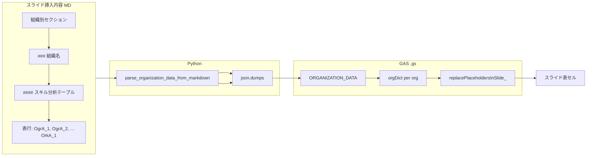

# 14 組織別スライド 表プレースホルダー置換要件

スライド3（組織別分析）の**テーブル内**に配置されたプレースホルダー（`{{OgrA_1}}`〜`{{OgrE_5}}`、`{{OgrF_1}}`〜`{{OgrF_5}}`、`{{OrkA_1}}`）が GAS 実行時に正しく置換されるためのデータ流れと要件を規定する。

## 1. 事象と原因

- **現象**: GAS 実行後、組織別スライドの「スキル分析テーブル」「WS理解度(平均)」のセルに `{{OgrA_1}}` 等のプレースホルダーが残り、数値が入らない。
- **原因（表が埋まらない）**:
  1. **パース条件の不足**: `parse_organization_data_from_markdown` が組織用プレースホルダーを検出する行条件に `'`{{O_' in line` を用いていたため、`{{OgrA_1}}`（O の次が `g`）や `{{OrkA_1}}`（O の次が `r`）が対象外となり、`ORGANIZATION_DATA` に Ogr*・OrkA_1 が格納されていなかった。
  2. **GAS 側**: `orgDataFromMarkdown['OgrA_1']` 等が存在しないため空文字となり、かつ従来は `replacePlaceholdersInSlide_` が空文字のとき置換をスキップしていたため、プレースホルダーが残っていた。
- **対応**: パース条件を **`'`{{O' in line`** に変更し、`O_`・`Ogr*`・`Ork*` をすべて拾う。GAS では空文字でもプレースホルダーを置換する（廃止プレースホルダーを空で置換するため）。

## 2. データ流れ（要件）

- **スライド挿入内容（全体）MD**: 各組織ブロックに「#### スキル分析テーブル（表内）」「#### 理解度」の表があり、行ごとに `| \`{{OgrA_1}}\` | 2.72 | ...`、`| \`{{OgrF_1}}\` | 2.29 | ...`（総合スコア。17 参照）および `| \`{{OrkA_1}}\` | 4.25 | ...` の形式で記載される（13_スライド3_組織別分析_プレースホルダー仕様 に準拠）。
- **パース**: `gas_generator.parse_organization_data_from_markdown(slide_content_path)` が上記 MD を読み、各組織の `current_org_data` に `OgrA_1`〜`OgrE_5`、`OgrF_1`〜`OgrF_5`、`OrkA_1` を格納する。値は「データ内容」列（表の2列目）から取得し、`-` や空でも格納する。行検出は `'{{O' in line` のため OgrF_* も対象となる。
- **GAS 埋め込み**: `organization_data_js = json.dumps(organization_data_from_markdown, ...)` でそのまま JSON 化し、.gs の `const ORGANIZATION_DATA = [...]` に埋め込む。**各組織オブジェクトに Ogr*（OgrF_* 含む）と OrkA_1 のキーが含まれていること**が必須。
- **GAS 実行時**: 各組織スライドで `orgDataFromMarkdown = ORGANIZATION_DATA[j]` を参照し、`getOgr('A', 1)` 等に加え `getOgr('F', 1)`〜`getOgr('F', 5)` で総合スコアを取得。`orgDict` に `'{{OgrF_1}}': value` 等を入れ、`replacePlaceholdersInSlide_(slide, orgDict)` でスライド全体（テーブル含む）のプレースホルダーを置換する。

## 3. 要件一覧

| 要件ID | 内容 |
|--------|------|
| R1 | スライド挿入内容 MD の組織別セクションには、各組織ごとに「#### スキル分析テーブル（表内）」および「#### 理解度」の表があり、行に `\`{{OgrA_1}}\`` 〜 `\`{{OgrE_5}}\``、`\`{{OgrF_1}}\`` 〜 `\`{{OgrF_5}}\``（総合スコア。17 参照）および `\`{{OrkA_1}}\`` が含まれること（13 仕様どおり）。 |
| R2 | `parse_organization_data_from_markdown` は、上記表の「プレースホルダー」列と「データ内容」列を解析し、`current_org_data[placeholder_id] = data_value` で格納すること。**行の検出条件**は `'`{{O' in line` かつ `'}}`' in line` かつ `'|' in line` とし、`O_`・`Ogr*`（OgrF_* 含む）・`Ork*` のいずれも拾うこと（`{{O_` のみにすると Ogr/Ork が漏れる）。ヘッダー行（データ内容＝「データ内容」）は除外し、それ以外（数値・`-`・空）はすべて格納すること。 |
| R3 | GAS コード生成時に、`ORGANIZATION_DATA` にパース結果を**全キー含めて**出力すること。組織オブジェクトに `OgrA_1`〜`OgrE_5`、`OgrF_1`〜`OgrF_5`、`OrkA_1` が含まれていないと、表のプレースホルダーは置換されない。 |
| R4 | GAS の `replacePlaceholdersInSlide_` は、スライド内のテーブル・グループ内テキストも対象とすること（`slide.replaceAllText(key, value)` またはフォールバックでテーブルセルを走査すること）。また、**value が空文字のときも置換すること**（廃止プレースホルダー `{{O_block_1_body}}` を空で置換するため）。 |
| R5 | GAS 実行前に、使用する .gs が**直近でスライド挿入内容 MD から再生成されたもの**であること。MD を変更した場合は「Phase N 用 GAS コードを生成」または `regenerate_project_reports.py` で .gs を再生成し、その .gs を Apps Script に貼り付けて実行すること。 |

## 4. 検証方法

- **ORGANIZATION_DATA の確認**: 生成された .gs を開き、`const ORGANIZATION_DATA = [` の直後の最初の組織オブジェクトに `"OgrA_1"`, `"OgrA_2"`, `"OgrF_1"`, `"OgrF_2"`, `"OrkA_1"` 等のキーが存在するかを確認する。
- **実行後**: 組織別スライドの「スキル分析テーブル」「WS理解度(平均)」のセルに、プレースホルダーではなく数値（または Phase2 の `-`）が表示されることを確認する。

## 5. 参照

- プレースホルダー一覧・表記ルール: [13_スライド3_組織別分析_プレースホルダー仕様.md](13_スライド3_組織別分析_プレースホルダー仕様.md)
- 総合スコア行（OgrF_*）: [17_スキル分析テーブル_総合スコア行追加要件.md](17_スキル分析テーブル_総合スコア行追加要件.md)
- GAS 連携概要: [06_GAS連携.md](06_GAS連携.md)
